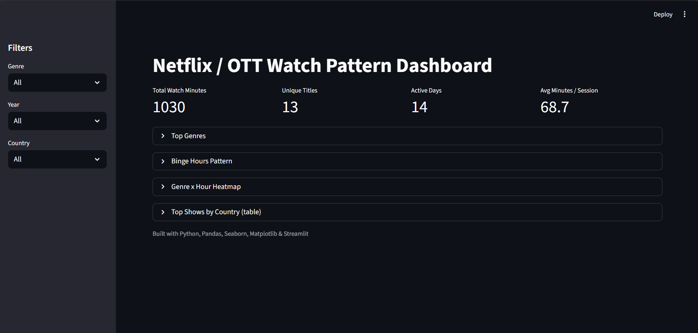

# Netflix / OTT Watch Pattern Dashboard

## Overview
Interactive Streamlit dashboard that shows:
- Top genres, binge hours (day/night), top shows by country
- Genre x Hour heatmap and duration analysis
- Filters: Genre → Year → Country

## Tech stack
Python, Pandas, Matplotlib, Seaborn, Streamlit, GitHub, Streamlit Cloud 

## Quick start
1. Clone repo
2. Create venv: `python -m venv .venv && source .venv/bin/activate`
3. Install: `pip install -r requirements.txt`
4. Run: `streamlit run app.py`

## Dataset
Add your CSV to `data/watch_history.csv`. See `data/sample_watch_history.csv` for schema.

## Demo

## Deployment
- Deployed on Streamlit Cloud:https://netflix-dashboard-egrze9f9evsfym52evdcw7.streamlit.app/
## License
MIT

